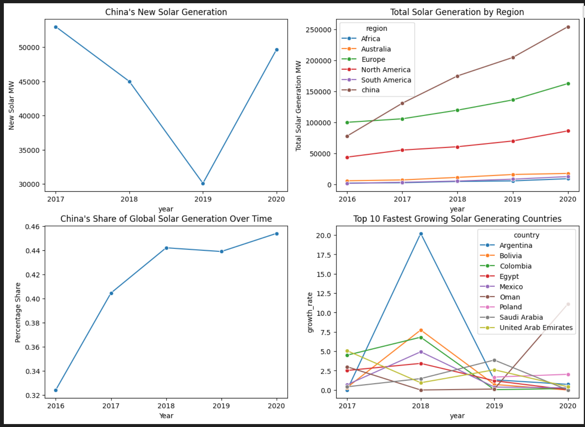
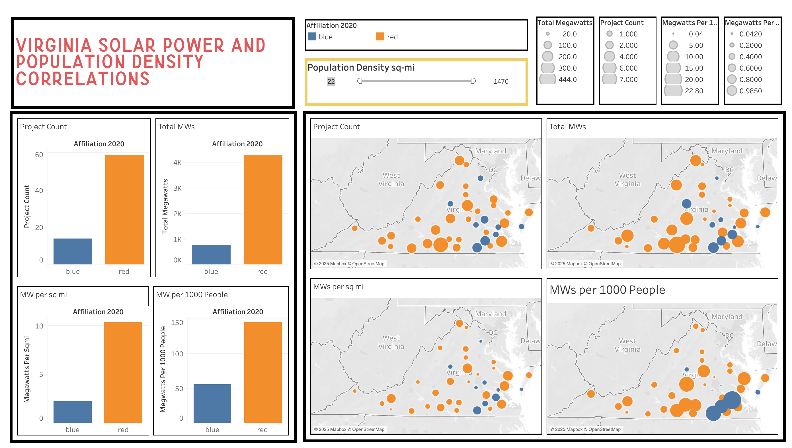
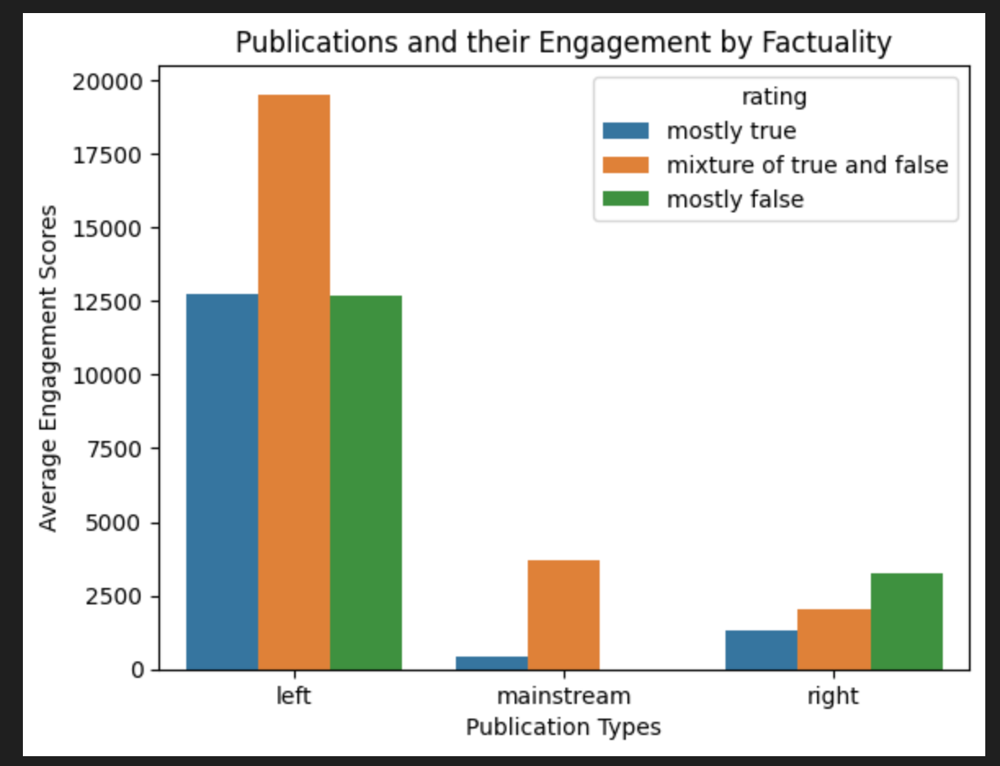

# 📊 Data Analysis Portfolio

Thank you for viewing my data analysis portfolio! This repo includes three projects that showcase my ability to find insights, trends, and correlations in the fields of solar power and political engagement. These finding are obtained through the practices of Exploratory Data Analysis (EDA), Explore Transform Load (ETL) processes, and statistical testing. Tools and techniques used are:

- Python:
    - pandas, seaborn and matplotlib libraries
    - Data collection
- SQL:
    - Database management
    - Querying and filtering
- Statistics:
    - Hypothesis testing
    - Distribution analysis
    - Correlation analysis
- Storytelling:
    - Communicating insights through data-driven narratives
- Tableau:
    - Dynamic dashboards

## 🌍 1. Global Solar Trends (2016–2020)
**Focus:** International solar growth by region and country.
- Compared total and new solar capacity by year.
- Tracked China's outsized growth and declining % rate of new installs.
- Evaluated solar development vs. GDP per capita and population density.
- Includes insights into regional leadership and Tableau dashboards

## 🔆 2. Virginia Solar Permit Analysis
**Focus:** Analyzing the correlation between population density and solar growth for a given Virginian locality.
- Analyzed demographic, political, and economic correlations with solar approvals.
- Explored solar efficiency (by square mile) between right and left affiliated localities.
- Identified state level patterns in solar growth.
- Includes statistical tests and Tableau dashboards

## 📰 3. Facebook Engagement & Misinformation
**Focus** Analyzing the difference in engagement trends between right and left affiliated Facebook pages.
- Investigated engagement rates by post type and truthfulness.
- Compared left vs. right-leaning pages in terms of content and reach.
- Duplicated the findings found in the original BuzzFeed article on this dataset.
- Includes statistical tests and Tableau dashboards

## 📎 About Me
I'm a data-analyst with a background in political organizing and solar development. I enjoy combining my domain knowledge and technical skills to answer meaningful questions through data.

📬 **Contact:**
- adrielstokes2@gmail.com
- https://www.linkedin.com/in/adriel-stokes/
- https://adriels-portfolio-d40b63.webflow.io/
